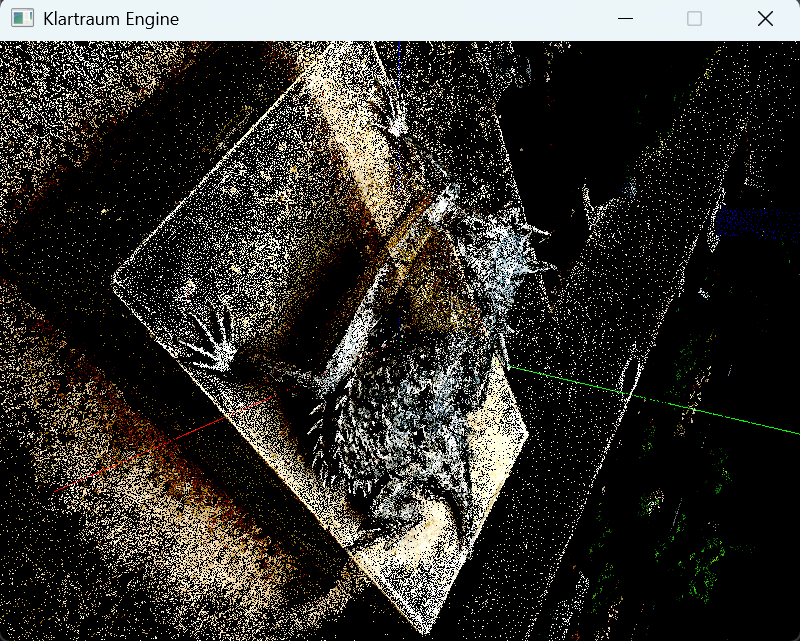

# klartraum
Klartraum will be a real-time neural rendering and inference engine build on top of Vulkan.

The general idea is to provide an execution environment for pretrained deep learning algorithms that runs on a multitude of hardware, given that Vulkan 1.3 is available. Thus, it enables a wide range of embedded devices that span from single-board computers as Raspberry Pies to Virtual Reality headsets to use algorithms as
* Convolutional Neural Networks
* Diffusion networks
* Gaussian splatting
* Transformers and LLMs

Also it is possible to combine them with classical real-time rendering using Vulkan. This way, complex neural rendering pipelines can be created that for instance first performs Gaussian Splatting in an embedding space, decodes them using a CNN-Decoder, combines it with classic rasterization or raytracing and finally runs DLSS to increase resolution and fidelity. 

Alternatively, it can be simply used as hardware independent neural network inference engine for classical deep learning applications.

A design principle of Klartraum is that all operations shall be as precomputed as possible so that for a single inference only the command buffers have to be submitted, without re-recording to free up CPU as much as possible and reduce latency.

# design

What you do with Klartraum is to write draw graphs that contain processing nodes that perform various graphics and compute operations on Vulkan buffers.

It works with the Klartraum Engine, which also handles user input etc, but also as a standalone that takes vulkan rendering
buffers.

# example



```cpp
#include <iostream>

#include "klartraum/glfw_frontend.hpp"

#include "klartraum/draw_basics.hpp"
#include "klartraum/vulkan_gaussian_splatting.hpp"
#include "klartraum/interface_camera_orbit.hpp"

int main() {
    std::cout << "Wake up, dreamer!" << std::endl;

    klartraum::GlfwFrontend frontend;

    auto& core = frontend.getKlartraumCore();

    std::shared_ptr<klartraum::DrawBasics> axes =
        std::make_shared<klartraum::DrawBasics>(klartraum::DrawBasicsType::Axes);

    core.addDrawComponent(axes);

    std::string spzFile = "data/hornedlizard.spz";
    std::shared_ptr<klartraum::VulkanGaussianSplatting> splatting =
        std::make_shared<klartraum::VulkanGaussianSplatting>(spzFile);

    core.addDrawComponent(splatting);

    std::shared_ptr<klartraum::InterfaceCamera> cameraOrbit =
        std::make_shared<klartraum::InterfaceCameraOrbit>();

    core.setInterfaceCamera(cameraOrbit);

    frontend.loop();

    return 0;
}
```
# Build
## Prerequisites
THIS SECTIONS NEEDS A REWORK!


